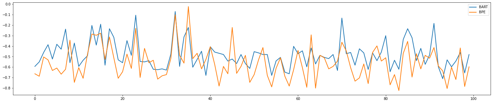

## Description

This summarizer attempts to leverage Byte Pair Encoding (BPE) tokenization and the GPT2 vocabulary to filter text by semantic meaningfulness.

BPE text representation is a subword level approach to tokenization which aims to efficiently reuse parts of words while retaining semantic value.

The algorithm is based on the frequency of n-gram pairs. More frequent pairs are represented by larger tokens.

This project explored the assumption that token size correlates strongly to semantic meaningfulness. This summarization approach intends to surface the most meaningful sentences with comparing token values and retaining sentences from the original text that included meaningful tokens within a specified percentile.

## Usage

```
from summarizer import bpe_summarize

bpe_summarize(article, percentile=99)
```

## Examples

**Human Summary**

<blockquote>

Building Deep Dependency Structures Using A Wide-Coverage CCG Parser

This paper describes a wide-coverage statistical parser that uses Combinatory Categorial Grammar (CCG) to derive dependency structures.

The parser differs from most existing wide-coverage treebank parsers in capturing the long-range dependencies inherent in constructions such as coordination, extraction, raising and control, as well as the standard local predicate-argument dependencies.

A set of dependency structures used for training and testing the parser is obtained from a treebank of CCG normal-form derivations, which have been derived (semi-) automatically from the Penn Treebank.\nThe parser correctly recovers over 80% of labelled dependencies, and around 90% of unlabelled dependencies.

We provide examples showing how heads can fill dependency slots during a derivation, and how long-range dependencies can be recovered through unification of co-indexed head variables.

We define predicate argument structure for CCG in terms of the dependencies that hold between words with lexical functor categories and their arguments.\n
</blockquote>

**BPE Summary**

<blockquote>

Building Deep Dependency Structures Using A Wide-Coverage CCG Parser

This paper describes a wide-coverage statistical parser that uses Combinatory Categorial Grammar (CCG) to derive dependency structures.

The parser differs from most existing wide-coverage treebank parsers in capturing the long-range dependencies inherent in constructions such as coordination, extraction, raising and control, as well as the standard local predicate-argument dependencies.

A set of dependency structures used for training and testing the parser is obtained from a treebank of CCG normal-form derivations, which have been derived (semi-) automatically from the Penn Treebank. The parser correctly recovers over 80% of labelled dependencies, and around 90% of unlabelled dependencies. However, the dependencies are typically derived from a context-free phrase structure.
</blockquote>

## Evaluation

To evaluate the quality of the summarization, we apply a [semantic similarity metric](https://www.tensorflow.org/api_docs/python/tf/keras/losses/cosine_similarity), to compare auto-summarized examples with human summaries from the [scisummnet dataset](https://cs.stanford.edu/~myasu/projects/scisumm_net/). Text was represented using [sentence-level embeddings](https://tfhub.dev/google/universal-sentence-encoder/4). Figure 1. charts the results from BPE as compared to [Bart](https://huggingface.co/transformers/model_doc/bart.html). BPE performed competitively and completed summarization in one one-hundredth of a second as compared to Bart's 55 seconds over 100 samples (CPU).


<p style="text-align: center;"><small>Fig1. BPE / Bart</small></p>

**References:**
- [Language Models are Unsupervised Multitask Learners, Radford, et.al](paper/language_models_are_unsupervised_multitask_learners.pdf)
- [Huggingface/GPT Tokenizer](https://github.com/huggingface/transformers/blob/827d6d6ef071029cfe82838a18dab046b5813976/src/transformers/tokenization_gpt2.py)
- [GPT-2/Encoder](https://github.com/openai/gpt-2/blob/master/src/encoder.py)
- [Comparing Transformers and Tokenizers, Németh](https://towardsdatascience.com/comparing-transformer-tokenizers-686307856955)
- [Huggingface Bart Summarization Pipeline](https://huggingface.co/transformers/model_doc/bart.html)
