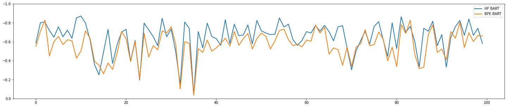

## Description

This summarizer attempts to leverage BPE tokenization and the GPT2 vocabulary to filter text by semantic meaningfulness.

BPE text representation is a subword level approach to tokenization which aims to efficiently reuse parts of words while retaining semantic value.

The algorithm is based on the frequency of n-gram pairs. More frequent pairs are represented by larger tokens.

Inherently, the token size would also imply semantic meaningfulness. This summarization approach intends to surface the most meaningful sentences with comparing token values.

 ## Evaluation

 The project applied [semantic similarity metric](https://www.tensorflow.org/api_docs/python/tf/keras/losses/cosine_similarity), to compare auto-summarized examples with human summaries from the [scisummnet dataset](https://cs.stanford.edu/~myasu/projects/scisumm_net/).

 
 > BPE / BART

 **References:**
 - [Language Models are Unsupervised Multitask Learners, Radford, et.al](paper/language_models_are_unsupervised_multitask_learners.pdf)
 - [Huggingface/GPT Tokenizer](https://github.com/huggingface/transformers/blob/827d6d6ef071029cfe82838a18dab046b5813976/src/transformers/tokenization_gpt2.py)
 - [GPT-2/Encoder](https://github.com/openai/gpt-2/blob/master/src/encoder.py)
 - [Comparing Transformers and Tokenizers, Németh](https://towardsdatascience.com/comparing-transformer-tokenizers-686307856955)
 - [Huggingface Bart Summarization Pipeline](https://huggingface.co/transformers/model_doc/bart.html)
